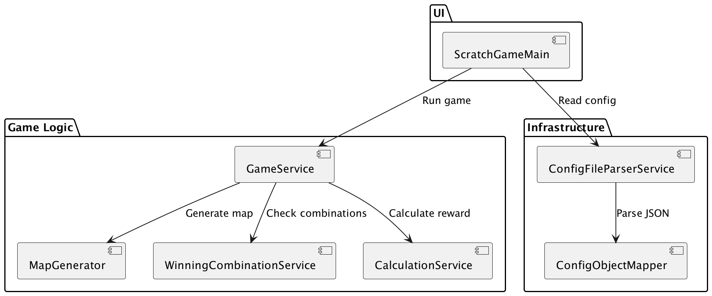
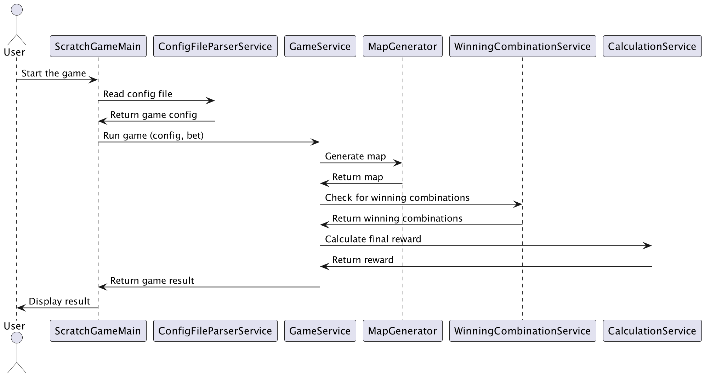

# CyberSpeed - Scratch Game

## Description

This project implements a scratch game where the player generates a nxm matrix of symbols and bets a specified amount. Based on winning combinations, the player either wins or loses.

### Game Logic

There are two types of symbols:

- **Standard Symbols**: Determines if the user won or lost based on winning combinations.
- **Bonus Symbols**: Apply only when there is at least one winning combination.

Winning combinations include repeated symbols (in rows, columns, or diagonals) and covered areas specified in the configuration file.

**Bonus Symbols and Effects**:
- `10x`, `5x`: Multiply the final reward.
- `+1000`, `+500`: Add a specific amount to the final reward.
- `MISS`: No effect.

## Requirements

- **JDK** >= 21
- **Gradle** >= 7.x
- **mavenCentral** for dependencies

## Installation

1. Clone the repository:
   ```bash
   git clone https://github.com/glaptev8/CyberSpeed.git
   cd CyberSpeed
   ```

2. Build the project:
   ```bash
   ./gradlew clean build
   or
   ./gradle clean build
   ```

3. Run the game:
   ```bash
   java -jar build/libs/CyberSpeed-1.0-SNAPSHOT.jar --config <path_to_config.json> --betting-amount <bet>
   ```

4. Run the game without build:
   ```bash
   java -jar CyberSpeed-1.0-SNAPSHOT.jar --config <path_to_config.json> --betting-amount <bet>
   ```

4. Run the tests:
   ```bash
   ./gradlew test
   or
   ./gradle test
   ```

## Example

```bash
java -jar build/libs/CyberSpeed-1.0-SNAPSHOT.jar --config example.json --betting-amount 100
```

Example output:

```json
{
  "matrix": [
    ["A", "A", "B"],
    ["A", "+1000", "B"],
    ["A", "A", "B"]
  ],
  "reward": 6600,
  "applied_winning_combinations": {
    "A": ["same_symbol_5_times", "same_symbols_vertically"],
    "B": ["same_symbol_3_times", "same_symbols_vertically"]
  },
  "applied_bonus_symbol": "+1000"
}
```

## UML Diagrams

## Component Diagram


## Sequence Diagram

